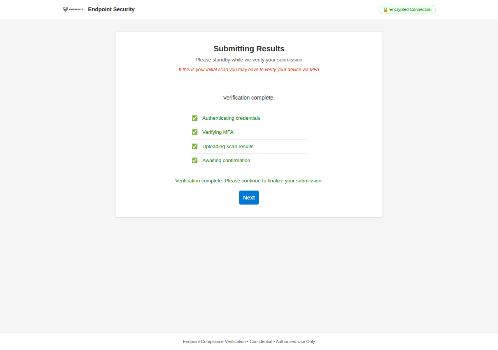

# WhisperGate

<p align="center">
  
</p>

<p align="center">
  <strong>Credential harvesting framework for authorized phishing &amp; vishing assessments</strong>
</p>

<p align="center">
  <a href="#features">Features</a> •
  <a href="#how-it-works">How It Works</a> •
  <a href="#quick-start">Quick Start</a> •
  <a href="#customization">Customization</a> •
  <a href="#disclaimer">Disclaimer</a>
</p>

---

## Overview

WhisperGate is a credential harvesting tool designed for professional penetration testers conducting authorized phishing and vishing engagements. It serves a realistic endpoint compliance scanner that walks targets through a multi-stage flow — from device scan to credential capture — providing operators with the time and believability needed during live phone-based social engineering.

Built by [@whisk3y3](https://github.com/whisk3y3)

---

## Features

- **Multi-stage flow** — automated scan → results → login → verification hold → redirect
- **Realistic scan simulation** — animated progress bar with 8 compliance checks (OS, AV, firewall, BitLocker, patches, browser extensions, EDR, certificates)
- **Professional UI** — clean enterprise-grade design using Segoe UI, proper form validation, encrypted connection badge
- **Operator-controlled pacing** — configurable hold timer on the verification screen gives you time on the call
- **Per-client branding** — swap logo and primary color via CSS variables in seconds
- **Timestamped logging** — credentials logged with timestamp, source IP, and real-time console output
- **M365 redirect** — final "Next" button sends target to legitimate Microsoft 365 apps page
- **SSL/TLS ready** — built-in support for Let's Encrypt certificates
- **Responsive** — works on desktop and mobile browsers

---

## How It Works

WhisperGate walks the target through three stages:

### Stage 1 — Endpoint Compliance Scan

An animated scanner checks the target's device against organizational policy. Items appear one by one with pass/fail indicators. This stage runs automatically for ~8 seconds.


### Stage 2 — Scan Results & Login

Results display in a professional table with compliance status badges. Below the results, the target is prompted to authenticate with their network credentials to "submit results to the Helpdesk."


### Stage 3 — Verification Hold & Redirect

After credential submission, the simulation transitions into a staged verification sequence designed to mirror legitimate enterprise authentication workflows. The user is shown step by step progress indicators such as “Authenticating credentials” followed by “Verifying MFA,” which persists for approximately 30 seconds to replicate real world authentication delays.

From a defensive standpoint, this phase is critical. Adversaries often use artificial verification screens to create urgency and normalize unexpected MFA prompts. During this window, a target may receive an unsolicited push notification, number matching request, or other multi factor challenge. Attackers rely on confusion, authority, or time pressure to persuade the user to approve the request. This is where you work your magic.

Once the 30 second verification period concludes, the page displays “Verification complete.” The “Next” button then becomes available and redirects the user to https://m365.cloud.microsoft/apps
.




---

## Quick Start

> **Recommended:** Spin up an AWS EC2 instance (Ubuntu 22.04+, t2.micro works fine) to host WhisperGate. This keeps your phishing infrastructure isolated and gives you a clean public IP for your domain's DNS records.

### Prerequisites

- Python 3.8+
- A phishing domain with DNS records pointing to your server
- SSL/TLS certificate (Let's Encrypt recommended)

### Installation

```bash
git clone https://github.com/whisk3y3/WhisperGate.git
cd WhisperGate
python3 -m venv venv
source venv/bin/activate
pip install -r Requirements.txt
```

### Generate SSL Certificate

```bash
sudo apt install certbot
sudo certbot certonly --standalone -d yourdomain.com
```

### Configure

Edit `WhisperGate.py` and update the certificate paths:

```python
cert_file = '/etc/letsencrypt/live/yourdomain.com/fullchain.pem'
key_file = '/etc/letsencrypt/live/yourdomain.com/privkey.pem'
```

Update the target email domain and minimum password length:

```python
EMAIL_DOMAIN = '@targetcompany.com'
MIN_PASS_LEN = 1
```

### Run

```bash
sudo python3 WhisperGate.py
```

Open a second terminal to monitor captured credentials in real-time:

```bash
tail -f credentials.txt
```

Credentials are also printed to the WhisperGate console with timestamps and source IPs as they come in.

---

## Customization

### Branding

WhisperGate is designed for easy per-client rebranding:

1. **Logo** — Replace `static/images/logo.png` with the client's logo (or a generic corporate logo)
2. **Primary color** — Edit the `--color-primary` CSS variable in `static/css/styles.css`:

```css
:root {
  --color-primary: #0078d4;       /* Swap this per engagement */
  --color-primary-hover: #106ebe;
}
```

3. **Brand text** — Update the header text in `templates/index.html`:

```html
<span class="brand-text">Endpoint Security</span>
```

4. **Scan results** — Customize the compliance checks in the `CHECKS` array in `templates/index.html` to match the target environment

5. **Redirect URL** — Change the final redirect destination in the Next button `onclick` handler

### Timing

Adjust these constants in `templates/index.html`:

| Variable | Default | Description |
|----------|---------|-------------|
| `SCAN_MS` | `8000` | How long the scan animation runs in ms (minimum ~5000 recommended) |
| `NEXT_DELAY` | `30000` | How long before the Next button appears after cred submission (ms) |

---

## Project Structure

```
WhisperGate/
├── WhisperGate.py           # Flask backend — serves pages, captures creds
├── Requirements.txt         # Python dependencies
├── credentials.txt          # Captured credentials (auto-created)
├── LICENSE
├── README.md
├── templates/
│   └── index.html           # Multi-stage phishing page
├── static/
│   ├── css/
│   │   └── styles.css       # All styling — CSS variables at top for rebranding
│   └── images/
│       └── logo.png         # Client logo (swap per engagement)
└── screenshots/             # README images
```

---

## Credential Log Format

```
[2025-03-01 14:23:17] IP: 192.168.1.50 | Email: john.smith@company.com | Password: Summer2025!
[2025-03-01 14:25:44] IP: 192.168.1.72 | Email: jane.doe@company.com | Password: Welcome123!
```

---

## Disclaimer

WhisperGate is intended **exclusively** for authorized security assessments. Before using this tool:

- Obtain written authorization from the target organization
- Ensure the engagement scope explicitly includes phishing/vishing
- Comply with all applicable laws and regulations
- Handle captured credentials according to your engagement's rules of engagement

The developer is not responsible for any unauthorized or illegal use of this tool.

---

## Contributing

Contributions welcome. Open an issue or submit a PR.

## License

[MIT](LICENSE)
