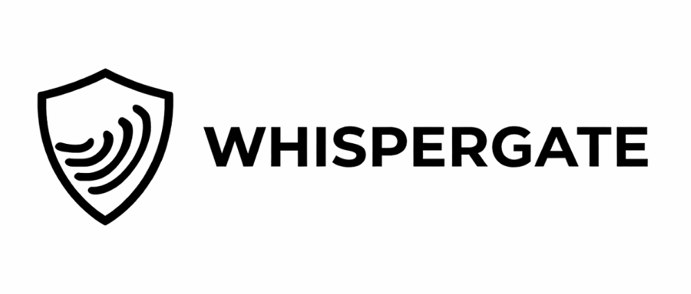
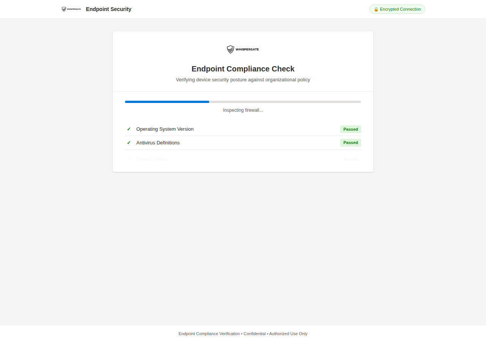
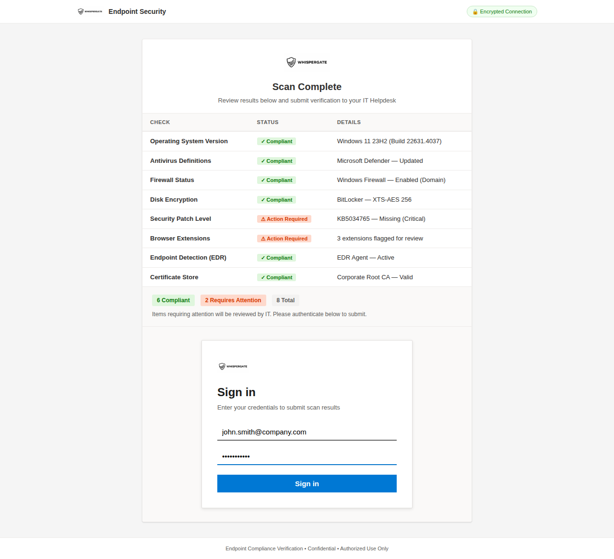
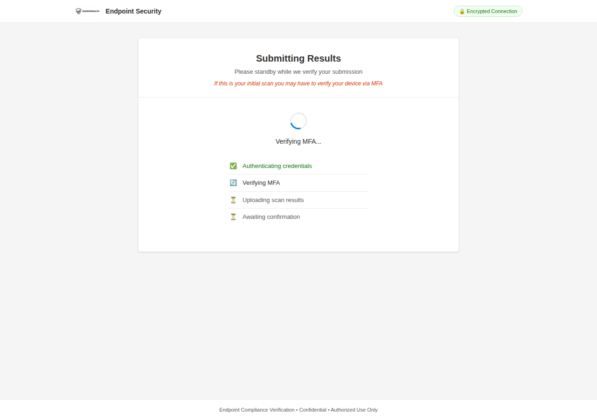

# WhisperGate

<p align="center">
  
</p>

<p align="center">
  <strong>Multi-stage credential harvesting framework for authorized phishing &amp; vishing assessments</strong>
</p>

<p align="center">
  <a href="#features">Features</a> •
  <a href="#how-it-works">How It Works</a> •
  <a href="#operator-panel">Operator Panel</a> •
  <a href="#quick-start">Quick Start</a> •
  <a href="#customization">Customization</a> •
  <a href="#disclaimer">Disclaimer</a>
</p>

---

## Overview

WhisperGate is a credential harvesting tool built for professional penetration testers conducting authorized phishing and vishing engagements. It presents a realistic endpoint compliance scanner that walks targets through a multi-stage flow — device scan, results review, SSO authentication, and an operator-controlled verification hold — giving operators full control over pacing during live phone-based social engineering.

The tool supports multiple simultaneous targets with per-target session isolation. Each target gets their own card on the operator panel with independent controls, status tracking, credential copy buttons, and notes. Operators can mark MFA bypass, release individual targets, and export everything to a formatted Excel report.

Built by [@whisk3y3](https://github.com/whisk3y3)

---

## Features

### Core Flow
- **Multi-stage pipeline** — scan → results → SSO email → org lookup → password → verification hold → operator release → completion
- **Browser fingerprinting** — scan results are dynamically generated from the target's actual user agent, OS, browser version, screen resolution, and timezone
- **Split SSO login** — email and password are collected on separate screens with a "Taking you to your organization's sign-in page..." loading transition, mirroring real Microsoft/Okta/Entra ID flows
- **Per-engagement branding** — set `ORG_NAME` once and it flows through the SSO hint, org lookup screen, and completion message
- **First-attempt rejection** — the first password submission is rejected with a realistic error message; both passwords are logged (configurable)
- **Operator-controlled release** — the verification screen holds indefinitely until the operator releases that specific target
- **Clean exit** — after release, the target sees "Submission Complete — You may close this window" instead of a redirect

### Operator Panel
- **Per-target cards** — each target gets their own card showing email, IP, session ID, all captured passwords, and a status badge
- **Status progression** — Scanning → Captured → MFA Pending → Compromised → Released, updated in real-time
- **Per-target isolation** — releasing one target doesn't affect any others; WebSocket rooms are scoped per session
- **One-click credential copy** — Copy Username and Copy Latest Password buttons on each card, plus individual Copy buttons on every password entry
- **Mark Compromised** — appears when a target is in MFA Pending status; tags the target as MFA bypassed before release
- **Per-target notes** — textarea on every card for documenting outcomes; auto-saves and exports with the report
- **Engagement timer** — running clock from first credential capture, plus per-target timers showing elapsed time since each target's first submission
- **Stats dashboard** — Total Targets, Creds Captured, MFA Bypassed, and Released at a glance
- **Excel export** — one-click download with two sheets: Captured Credentials (full details per attempt) and Engagement Summary
- **State persistence** — refreshing the operator panel reloads all existing target data from the server

### Realism Details
- **Session awareness** — page state persists across refreshes; targets who reload skip the scan and return to results
- **Randomized scan timing** — each compliance check takes a different amount of time with natural variance
- **OS-aware results** — scan output adapts per platform (BitLocker/FileVault/LUKS, Defender/XProtect/ClamAV, etc.)
- **Contextual MFA notice** — appears only during the MFA verification step with a device approval prompt
- **Subtle top bar** — policy reference number instead of an "encrypted connection" badge
- **Favicon** — inline SVG shield icon so the browser tab looks legitimate

---

## How It Works

WhisperGate walks the target through five stages:

### Stage 1 — Endpoint Compliance Scan

The page fingerprints the target's browser and builds compliance check results using real device data. An animated scanner reveals each check with randomized timing over approximately 12 seconds.

> **Conference demo note:** On a Mac, the scan shows macOS, FileVault, XProtect, and Safari/Chrome. On Windows, it shows Windows 11, BitLocker, Defender, and Edge/Chrome. All derived from the browser's own telemetry.



### Stage 2 — Scan Results

Results display in a compliance table with pass/fail badges. A "Submit to IT Helpdesk" button sits below the summary with a note: *"You will be prompted to authenticate with your [Org] account."*



### Stage 3 — SSO Authentication (Email → Password)

Clicking "Submit to IT Helpdesk" transitions to a standalone sign-in page. The target enters their email first, sees a loading screen (*"Taking you to your organization's sign-in page..."*), then the password page with the hint *"Sign in with your [Org] account."*

The first password is rejected with *"Your account or password is incorrect."* The second attempt succeeds. Both are captured and logged.

<!-- Screenshots needed: stage3_email.png, stage3_org_lookup.png, stage3_password.png, stage3_password_error.png -->

### Stage 4 — Verification Hold & MFA Window

After authentication, the page shows a staged verification sequence:

1. **Authenticating credentials** (3s)
2. **Verifying MFA** (7s) — contextual notice: *"A verification request has been sent to your registered device."*
3. **Uploading scan results** (14s)
4. **Awaiting confirmation** (20s+) — **holds indefinitely**

This is the operator's working window. The target's card appears on the operator panel:

1. **Copy Username** → paste into your M365 login tab
2. **Copy Latest Password** → paste → submit
3. Microsoft sends MFA push → target approves (primed by on-screen notice)
4. **Mark Compromised** on the operator panel (tags MFA bypass)
5. **Release Target** → only that target sees the completion screen



### Stage 5 — Completion

When released, the target sees:

> ✅ **Submission Complete**
>
> Your scan results have been submitted to the [Org] IT Helpdesk. No further action is required.
>
> *You may close this window.*

No redirect, no suspicion.

---

## Operator Panel

Access the operator panel at:

```
https://yourdomain.com/operator?token=changeme
```

### Dashboard

The top stats bar shows real-time counts: Total Targets, Creds Captured, MFA Bypassed, and Released. An engagement timer starts when the first credential lands.

### Target Cards

Each target gets their own card with:

- **Email and IP** with session ID
- **Status badge** — Scanning → Captured → MFA Pending → Compromised → Released
- **All captured passwords** with attempt numbers, timestamps, and individual Copy buttons
- **Copy Username / Copy Latest Password** — quick-copy for relaying to a real login
- **Mark Compromised** — appears during MFA Pending; tags the target as MFA bypassed
- **Release Target** — sends the completion screen to that specific target only
- **Notes** — textarea for documenting outcomes; auto-saves to the server
- **Per-target timer** — elapsed time since first credential capture

### Excel Export

Click "Download Excel Report" in the sidebar. Generates a formatted `.xlsx` with:

**Sheet 1 — Captured Credentials:**
| Email | Password | Attempt | Timestamp | IP Address | User Agent | Status | MFA Bypassed | Released At | Notes |

**Sheet 2 — Engagement Summary:**
| Field | Value |
|-------|-------|
| Start Time | 2025-03-01 14:23:17 |
| Export Time | 2025-03-01 15:45:02 |
| Total Targets | 12 |
| MFA Bypassed | 8 |
| Organization | Contoso |

Filename format: `WhisperGate_Contoso_20250301_154502.xlsx`

### Recommended Operator Workflow

1. Open the operator panel in one browser window
2. Open `https://login.microsoftonline.com` in another tab
3. Call the target and direct them to the WhisperGate URL
4. Credentials land on the target's card → **Copy Username** → paste → **Copy Latest Password** → paste → submit
5. MFA push fires → talk the target through approving it
6. Hit **Mark Compromised** on their card
7. Hit **Release Target** — only that target sees the completion screen
8. Repeat for additional targets
9. **Download Excel Report** when the engagement wraps

> **Conference tip:** Run the operator panel on a second screen. The audience sees both the target experience and the operator's real-time control surface with status changes, timers, and credential captures.

### Multi-Target Note

Each target operates in their own WebSocket room. Releasing target A has no effect on target B. Multiple operators can have the panel open simultaneously — they all see the same live feed.

---

## Quick Start

> **Recommended:** Use an AWS EC2 instance (Ubuntu 22.04+, t2.micro) or similar VPS.

### Prerequisites

- Python 3.8+
- A domain with DNS records pointing to your server
- SSL/TLS certificate (Let's Encrypt recommended)

### Installation

```bash
git clone https://github.com/whisk3y3/WhisperGate.git
cd WhisperGate
python3 -m venv venv
source venv/bin/activate
pip install -r requirements.txt
```

### Generate SSL Certificate

```bash
sudo apt install certbot
sudo certbot certonly --standalone -d yourdomain.com
```

### Configure

Edit `WhisperGate.py` and update:

```python
# Certificate paths
cert_file = '/etc/letsencrypt/live/yourdomain.com/fullchain.pem'
key_file = '/etc/letsencrypt/live/yourdomain.com/privkey.pem'

# Engagement settings
EMAIL_DOMAIN = '@targetcompany.com'
MIN_PASS_LEN = 1
ADMIN_TOKEN = 'your-secret-token'    # Change this!
REJECT_FIRST_ATTEMPT = True          # Set False to accept first password
ORG_NAME = 'Contoso'                 # Target org name
```

### Branding Checklist

Before each engagement:

1. Set `ORG_NAME` in `WhisperGate.py`
2. Replace `static/images/logo.png` with the target's logo
3. Update `--color-primary` in `static/css/styles.css` to match the target's brand
4. Update the brand text in `templates/index.html` if needed
5. Update the reference number in the top bar if desired

### Run

```bash
tmux new -s server
sudo python3 WhisperGate.py
```

The operator panel is available at `https://yourdomain.com/operator?token=your-secret-token`.

Credentials are logged to `credentials.txt` and printed to the console in real-time. Without SSL certs present, WhisperGate starts in dev mode on port 5000.

---

## Customization

### Branding

1. **Organization name** — Set `ORG_NAME` in `WhisperGate.py`. Flows through to:
   - SSO login hint: *"Sign in with your [Org] account"*
   - Org lookup screen: *"Taking you to your organization's sign-in page..."*
   - Completion screen: *"Your scan results have been submitted to the [Org] IT Helpdesk."*
   - Excel export: org name in the Engagement Summary sheet and filename

2. **Logo** — Replace `static/images/logo.png` with the target organization's logo

3. **Primary color** — Edit `--color-primary` in `static/css/styles.css`:

```css
:root {
  --color-primary: #0078d4;       /* Swap per engagement */
  --color-primary-hover: #106ebe;
}
```

4. **Brand text** — Update the header in `templates/index.html`:

```html
<span class="brand-text">Endpoint Security</span>
```

5. **Reference number** — Change the policy ref in the top bar:

```html
<span class="top-bar-ref">Ref: SEC-2024-0847</span>
```

### Scan Results

Scan results are auto-generated from browser fingerprinting. Customize the `getFingerprint()` function in `templates/index.html` to add, remove, or modify checks. The two hardcoded failure items (Security Patch Level and Browser Extensions) can be adjusted to match the target environment.

### Configuration Reference

| Variable | Location | Default | Description |
|----------|----------|---------|-------------|
| `ORG_NAME` | `WhisperGate.py` | `Contoso` | Target org name — used throughout SSO flow, completion, and export |
| `EMAIL_DOMAIN` | `WhisperGate.py` | `@evilphishinc.com` | Target email domain |
| `REJECT_FIRST_ATTEMPT` | `WhisperGate.py` | `True` | Whether to reject the first password |
| `ADMIN_TOKEN` | `WhisperGate.py` | `changeme` | Access token for the operator panel |
| `SCAN_MS` | `index.html` | `12000` | Total scan duration in ms |

> **Note:** There is no hold timer to configure. The verification screen holds indefinitely until the operator releases each target individually from the control panel.

---

## Project Structure

```
WhisperGate/
├── WhisperGate.py              # Flask + SocketIO backend with per-target rooms
├── requirements.txt            # Python dependencies (flask, socketio, openpyxl)
├── credentials.txt             # Captured credentials (auto-created)
├── LICENSE
├── README.md
├── templates/
│   ├── index.html              # Multi-stage target-facing page
│   └── operator.html           # Real-time operator control panel
├── static/
│   ├── css/
│   │   └── styles.css          # All styling — CSS variables for rebranding
│   └── images/
│       └── logo.png            # Client logo (swap per engagement)
└── screenshots/
```

---

## Credential Log Format

```
[2025-03-01 14:23:17] IP: 192.168.1.50 | Email: john.smith@company.com | Password: Summer2025! | Attempt: 1
[2025-03-01 14:23:38] IP: 192.168.1.50 | Email: john.smith@company.com | Password: Fall2025!! | Attempt: 2
[2025-03-01 14:25:44] IP: 192.168.1.72 | Email: jane.doe@company.com | Password: Welcome123! | Attempt: 1
[2025-03-01 14:26:01] IP: 192.168.1.72 | Email: jane.doe@company.com | Password: Welcome123! | Attempt: 2
```

---

## Changelog

### v3.1
- Per-target WebSocket rooms — releasing one target doesn't affect others
- Operator panel rewritten with per-target cards, status progression, and independent controls
- Mark Compromised button for tagging MFA bypass before release
- Per-target notes with auto-save
- Engagement timer and per-target timers
- Stats dashboard (targets, creds, MFA bypassed, released)
- Excel export with Captured Credentials and Engagement Summary sheets
- Operator panel state persistence across refresh
- `ORG_NAME` config for per-engagement branding
- Completion screen ("You may close this window") replaces M365 redirect

### v3.0
- Browser fingerprint-aware scan results (OS, browser, resolution)
- Split SSO login: email → org lookup → password
- First-attempt password rejection (both logged)
- Operator-controlled verification hold (no auto-timer)
- Contextual MFA notice during verification step
- Session-aware refresh (skips scan on reload)
- Randomized per-check scan delays
- Policy reference number replaces "Encrypted Connection" badge
- Inline SVG favicon

---

## Disclaimer

WhisperGate is intended **exclusively** for authorized security assessments. Before using this tool:

- Obtain written authorization from the target organization
- Ensure the engagement scope explicitly includes phishing/vishing
- Comply with all applicable laws and regulations
- Handle captured credentials according to your engagement's rules of engagement

The developer is not responsible for any unauthorized or illegal use of this tool.

---

## Contributing

Contributions welcome. Open an issue or submit a PR.

## License

[MIT](LICENSE)
